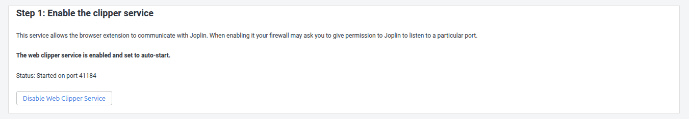
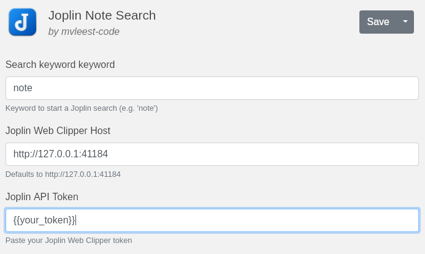
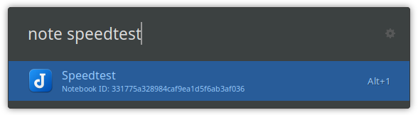
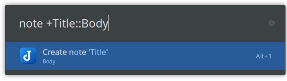

# UL Joplin Note Search for uLauncher

Joplin Note Search lets you browse and create notes in [Joplin](https://joplinapp.org/) directly from the uLauncher prompt by talking to the Web Clipper API.

If this saves you a little time (or sparks ideas for your own workflow), consider fueling future updates with a coffee:

<a href="https://www.buymeacoffee.com/mvleestapp" target="_blank">
  
</a>

## Features
- Search Joplin notes with fuzzy matching and quick preview snippets
- Create new notes inline with `+Title::Body` syntax
- Open notes in the desktop app (Web Clipper command) or via the `joplin://` fallback
- Configurable keyword, host, and API token via extension preferences

## Requirements
- [uLauncher](https://ulauncher.io/) v5 with extension API v2
- [Joplin](https://joplinapp.org/) desktop app running on your machine with the Web Clipper service enabled
- Joplin Web Clipper API token (Tools → Options → Web Clipper)

Make sure the Joplin desktop app stays open and the Web Clipper switch is turned on before invoking the extension.



## Installation
1. Open uLauncher preferences → Extensions.
2. Click **Add extension** and paste `https://github.com/mvleest-code/UL-JoplinNoteSearch`.
3. After it installs, open the extension directory at `~/.local/share/ulauncher/extensions/com.github.mvleest-code.ul-joplinnotesearch` (rename if needed).
4. Set your desired keyword, API host, and paste the Web Clipper token.

After saving the preferences, invoke uLauncher and type your keyword followed by a search query.



## Usage
- Search existing notes: `<keyword> your search terms`
- Create a new note: `<keyword> +Title::Optional body`
- Open a result: hit Enter on the desired note. If the Web Clipper command fails, the extension falls back to `joplin://` URLs.
- Typing only the keyword keeps uLauncher waiting—add search text or a `+Title::Body` payload to trigger the extension.





## Development
```bash
# Install or link the extension in the local uLauncher directory
mkdir -p ~/.local/share/ulauncher/extensions
ln -s $(pwd) ~/.local/share/ulauncher/extensions/com.github.mvleest-code.ul-joplinnotesearch

# Run ulauncher with logging for debugging
ulauncher -v
```

Logs are written to `debug.log` (ignored in git).

To prepare a release archive:

```bash
./scripts/package.sh
```

The script creates `dist/ul-joplinnotesearch.zip`, ready to attach to a GitHub release if you prefer manual distribution; uLauncher can also install directly from the repository URL.

## License
This project is licensed under the MIT License. See [LICENSE](LICENSE) for details.
